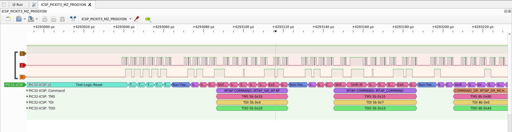
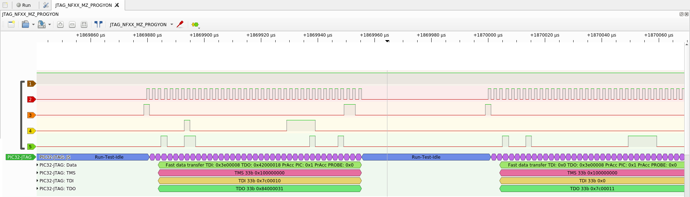

# PIC32-ProgrammingProtocolDecoders
ICSP and JTAG decoders for sigrok/pulseview, for the PIC32 family of microcontrollers

These decoders were used when developing additional JTAG&ICSP support for FTDI probes in pic32prog (now [progyon](https://gitlab.com/spicastack/progyon)).

## JTAG

The JTAG decoder should be fairly complete. It was used to check what a combination of J-Link & MPLAB did in JTAG mode, if a microcontroller was "stuck". That happened (and still does) for MX1/2 parts, if they are flashed via JTAG - further JTAG flashing needs a power cycle, or poking the chip into ICSP and then back.

(Not much is the answer btw, there was no special handling or rescuing of the controller. The reset was probably done via the PE, which wasn't implemented in pic32prog)

## ICSP

The ICSP decoder has been updated to the same level as the JTAG one. You can now see all the different JTAG states the controller goes through.

Originally this was written first, and then slightly modified, since Pickit 3 seemed to skip a cycle in XferFastData (PrAcc?). Looking at it now, I can't reproduce that error.

## Installation instruction

Either copy the pic32_jtag & pic32_icsp folder to where the decoders are located (`/usr/share/libsigrokdecode/decoders` under Ubuntu), or create a symlink. Both work just fine.

## Pictures

Provided are some pictures of the decoders in action

### ICSP

### JTAG

## Test data

There is some test data available in the `Test data` folder. All represent flashing some FW onto a PIC32MZ chip, and should be the same. (Or at least the Progyon versions are both the same, MPLAB might have a minor difference). 